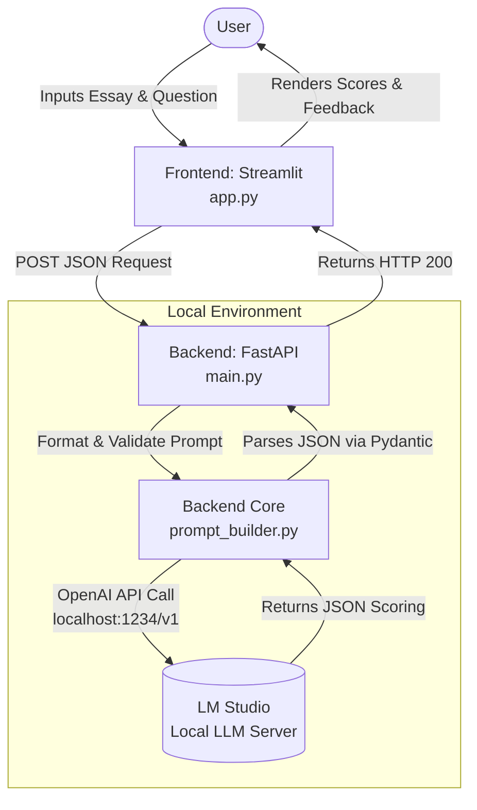

# PTE Essay Marking System - Implementation Specification

## Project Objective

Build a complete PTE Academic essay grading application with a Streamlit frontend and FastAPI backend that integrates with a local LLM (LM Studio) to provide automated essay scoring and feedback.

---

## System Architecture

**Data Flow:**
1. User inputs essay text and question via Streamlit UI
2. Frontend sends POST request with JSON payload to FastAPI backend
3. Backend constructs PTE marking prompt using predefined criteria
4. Backend calls local LLM server (LM Studio) via OpenAI-compatible API
5. LLM returns structured JSON with scores and feedback
6. Backend validates response using Pydantic models
7. Frontend displays results to user

---

## Technical Stack (MANDATORY VERSIONS)

**Core:**
- Python: `3.13.9` (implemented)
- Package Manager: `uv` (Rust-based, ultra-fast)

**Dependencies:**
- `streamlit==1.33.0` - Frontend UI
- `fastapi==0.110.1` - Backend API framework
- `uvicorn==0.29.0` - ASGI server
- `openai==1.16.2` - LLM client (pointing to localhost)
- `pydantic==2.12.5` - Data validation and parsing
- `python-dotenv==1.0.1` - Environment variable management

---

## Local LLM Configuration

**Model:** Meta Llama 3.1 8B Instruct (strong instruction-following, JSON output capability)

**LM Studio Server Configuration:**
- Endpoint: `http://localhost:1234`
- Model Name: `meta-llama-3.1-8b-instruct`
- API: OpenAI-compatible (use `openai` Python SDK)

**Verification Command:**
```bash
curl http://localhost:1234/api/v1/chat \
  -H "Content-Type: application/json" \
  -d '{
    "model": "meta-llama-3.1-8b-instruct",
    "system_prompt": "You answer only in rhymes.",
    "input": "What is your favorite color?"
}'
```

---

## Architecture Diagram (Mermaid)



---

## Project Structure (MUST FOLLOW EXACTLY)

```
pte-essay-marker/
├── .gitignore                  # MUST ignore: __pycache__/, .venv/, .env.*, .env.local, *.pyc
├── .env.example                # Template showing required environment variables
├── Makefile                    # Development automation commands (see Makefile section)
├── pyproject.toml              # Project metadata + uv dependency management
├── uv.lock                     # Auto-generated by uv (DO NOT manually edit)
├── README.md                   # Project overview, setup instructions
├── QUICKSTART.md               # Step-by-step developer guide
├── LICENSE.md                  # MIT License
│
├── docs/                       
│   ├── architecture.md         # System design + Mermaid diagrams
│   └── api_specs.md            # FastAPI endpoint documentation
│
├── data/                       
│   ├── sample_essays.json      # 5 sample essays (varying quality)
│   ├── sample_questions.json   # 5 PTE essay questions
│   └── expected_outputs.json   # Expected JSON responses for samples
│
├── frontend/                   
│   ├── app.py                  # Main Streamlit application
│   ├── requirements.txt        # (Optional) Frontend-only dependencies
│   └── assets/                 
│       └── styles.css          # Custom CSS styling
│
└── backend/                    
    ├── main.py                 # FastAPI app instance + route definitions
    ├── requirements.txt        # (Optional) Backend-only dependencies
    ├── core/                   
    │   ├── __init__.py
    │   ├── config.py           # Load .env.* using python-dotenv
    │   ├── schemas.py          # Pydantic models for request/response
    │   └── prompt_builder.py   # PTE prompt construction logic
    └── services/               
        ├── __init__.py
        └── llm_service.py      # OpenAI client → localhost:1234
```

---

## PTE Marking Criteria & JSON Schema

### Evaluation Criteria (7 Categories):

1. **Content** - Max score: 6
2. **Development, Structure & Coherence** - Max score: 6
3. **Form** - Max score: 2
4. **Grammar** - Max score: 2
5. **Linguistic Range** - Max score: 6
6. **Spelling** - Max score: 2
7. **Vocabulary** - Max score: 2

### Required JSON Output Schema:

```json
{
  "scores": {
    "content": { "score": <int 0-6>, "max": 6 },
    "development_structure_coherence": { "score": <int 0-6>, "max": 6 },
    "form": { "score": <int 0-2>, "max": 2 },
    "grammar": { "score": <int 0-2>, "max": 2 },
    "linguistic_range": { "score": <int 0-6>, "max": 6 },
    "spelling": { "score": <int 0-2>, "max": 2 },
    "vocabulary": { "score": <int 0-2>, "max": 2 }
  },
  "feedback": {
    "form": "<string: specific issues or 'Good, no form errors detected'>",
    "grammar": "<string: specific grammar mistakes>",
    "spelling": "<string: specific spelling errors>"
  },
  "good_points": [
    "<string: positive aspect 1>",
    "<string: positive aspect 2>",
    "... up to 5 points max"
  ],
  "improvements": [
    "<string: improvement suggestion 1>",
    "<string: improvement suggestion 2>",
    "... up to 5 points max"
  ]
}
```

### System Prompt for LLM (Embed in `prompt_builder.py`):
```
You are an expert PTE Academic English examiner. Your task is to evaluate an essay based on the provided question.

You must evaluate the essay across the following criteria:
- Content (Max 6)
- Development, structure and coherence (Max 6)
- Form (Max 2)
- Grammar (Max 2)
- Linguistic Range (Max 6)
- Spelling (Max 2)
- Vocabulary (Max 2)

You must output your response ONLY as a valid JSON object with the following schema:
{
  "scores": {
    "content": { "score": int, "max": 6 },
    "development_structure_coherence": { "score": int, "max": 6 },
    "form": { "score": int, "max": 2 },
    "grammar": { "score": int, "max": 2 },
    "linguistic_range": { "score": int, "max": 6 },
    "spelling": { "score": int, "max": 2 },
    "vocabulary": { "score": int, "max": 2 }
  },
  "feedback": {
    "form": "string (e.g., 'Good, no form errors detected' or list of issues)",
    "grammar": "string",
    "spelling": "string"
  },
  "good_points": [
    "string (point 1)",
    "string (point 2)" // max 5 points
  ],
  "improvements": [
    "string (improvement 1)",
    "string (improvement 2)" // max 5 points
  ]
}

Ensure your evaluation is strict, accurate, and helpful. Do not include any text outside the JSON object.
```

---

## Implementation Requirements

### Phase 1: Project Scaffolding & Sample Data (IMPLEMENT THIS FIRST)

**DO NOT implement actual LLM marking logic yet.** Focus on:

1. **Create complete project structure** as specified above
2. **Generate `pyproject.toml`** with all dependencies using `uv`
3. **Create sample data files** in `data/` directory:
   - `sample_essays.json`: 5 essays (~300 words each, varying quality: excellent, good, average, poor, very poor)
   - `sample_questions.json`: 5 PTE essay questions
   - `expected_outputs.json`: 5 complete JSON responses matching the schema above
4. **Create `.env.example`** with required variables:
   ```
   LLM_BASE_URL=http://localhost:1234
   LLM_MODEL_NAME=meta-llama-3.1-8b-instruct
   BACKEND_HOST=0.0.0.0
   BACKEND_PORT=8000
   FRONTEND_PORT=8501
   ```
5. **Create `.gitignore`** to exclude: `.env.*`, `.env.local`, `__pycache__/`, `.venv/`, `*.pyc`, `uv.lock`

### Phase 2: Makefile Commands

Create `Makefile` with these targets: 

```makefile
.PHONY: venv install run-backend run-frontend test test-backend test-frontend clean

venv:
	uv venv
	uv pip install -e .

install:
	uv sync

run-backend:
	cd backend && uvicorn main:app --reload --host 0.0.0.0 --port 8000

run-frontend:
	cd frontend && streamlit run app.py --server.port 8501

test:
	@echo "Running all tests..."
	make test-backend
	make test-frontend

test-backend:
	@echo "Backend tests not yet implemented"

test-frontend:
	@echo "Frontend tests not yet implemented"

clean:
	find . -type d -name "__pycache__" -exec rm -rf {} +
	find . -type f -name "*.pyc" -delete
	rm -rf .venv/ uv.lock
```

---

## Implementation Checklist

### You MUST create these files:

#### 1. Root Level Files

- [x] `.gitignore`
- [x] `.env.example`
- [x] `Makefile`
- [x] `pyproject.toml` (use `uv` package manager format)
- [x] `README.md` (project overview)
- [x] `QUICKSTART.md` (setup guide)
- [x] `LICENSE.md` (MIT License)

#### 2. Documentation (`docs/`)

- [x] `docs/architecture.md` (include mermaid diagram from above)
- [x] `docs/api_specs.md` (document FastAPI endpoints)

#### 3. Sample Data (`data/`)

- [x] `data/sample_essays.json` (5 essays, 300 words each, quality: excellent → very poor)
- [x] `data/sample_questions.json` (5 PTE essay prompts)
- [x] `data/expected_outputs.json` (5 JSON objects matching the output schema)

**Quality levels for essays:**
1. **Excellent** (24-26/26): Perfect grammar, rich vocabulary, strong coherence
2. **Good** (20-23/26): Minor errors, good structure, solid arguments
3. **Average** (15-19/26): Some grammar/spelling errors, adequate development
4. **Poor** (10-14/26): Multiple errors, weak structure, limited vocabulary
5. **Very Poor** (0-9/26): Severe errors, incoherent, off-topic

#### 4. Backend Files (`backend/`)

- [x] `backend/main.py`
  - FastAPI app instance
  - CORS middleware configuration
  - POST `/api/grade-essay` endpoint
  - Request: `{ "question": str, "essay": str }`
  - Response: JSON matching PTE schema
  
- [x] `backend/core/config.py`
  - Use `python-dotenv` to load `.env.local` or `.env.*`
  - Export: `LLM_BASE_URL`, `LLM_MODEL_NAME`, `BACKEND_PORT`
  
- [x] `backend/core/schemas.py`
  - Pydantic models: `EssayRequest`, `ScoreDetail`, `EssayResponse`
  - Strict validation for all fields
  
- [x] `backend/core/prompt_builder.py`
  - Function: `build_pte_prompt(question: str, essay: str) -> str`
  - Constructs full system prompt + user query
  
- [x] `backend/services/llm_service.py`
  - Initialize OpenAI client pointing to `localhost:1234`
  - Function: `grade_essay(question: str, essay: str) -> dict`
  - Handle API errors gracefully

#### 5. Frontend Files (`frontend/`)

- [x] `frontend/app.py`
  - Streamlit UI with:
    - Text area for essay question
    - Large text area for essay input (300+ words)
    - Submit button
    - Results display section showing:
      - Score breakdown (7 categories)
      - Feedback table
      - Good points (bullet list)
      - Improvements (bullet list)
  - Makes POST request to `http://localhost:8000/api/grade-essay`
  
- [x] `frontend/assets/styles.css` (optional custom styling)

---

## Critical Implementation Notes

### Environment Configuration
- Use `.env.local` for local development (ignored by git)
- Use `.env.example` as template (committed to git)
- Load env variables using `python-dotenv` in `backend/core/config.py`
- **Never hardcode** URLs or credentials

### Error Handling
- Backend must handle LLM connection failures
- Frontend must display user-friendly error messages
- Validate all Pydantic schemas strictly

### JSON Parsing
- LLM may return malformed JSON - implement retry logic
- Use Pydantic for strict validation
- Log all LLM responses for debugging

### Testing Strategy (Future)
- Unit tests for Pydantic models
- Integration tests for FastAPI endpoints
- Mock LLM responses for frontend testing

---

## PHASED IMPLEMENTATION PLAN

Execute these phases sequentially. Complete each phase fully before moving to the next.

---

### 🔧 PHASE 1: Development Environment Setup - DONE

**Objective:** Prepare the development environment and project scaffolding

**Tasks:**
1. Create root project directory: `pte-essay-marker/`
2. Initialize git repository
3. Create complete folder structure:
   ```bash
   mkdir -p docs data frontend/assets backend/core backend/services
   ```
4. Create all `__init__.py` files in Python packages:
   - `backend/core/__init__.py`
   - `backend/services/__init__.py`
5. Create `.gitignore` with content:
   ```
   # Python
   __pycache__/
   *.py[cod]
   *$py.class
   *.so
   .Python
   
   # Virtual Environment
   .venv/
   venv/
   ENV/
   
   # Environment Variables
   .env
   .env.*
   .env.local
   !.env.example
   
   # uv
   uv.lock
   
   # IDE
   .vscode/
   .idea/
   *.swp
   *.swo
   
   # OS
   .DS_Store
   Thumbs.db
   ```
6. Create `LICENSE.md` (MIT License)
7. Create `pyproject.toml` with uv configuration:
   ```toml
   [project]
   name = "pte-essay-marker"
   version = "0.1.0"
   description = "PTE Academic Essay Grading System with LLM"
   readme = "README.md"
   requires-python = ">=3.11"
   dependencies = [
       "streamlit==1.33.0",
       "fastapi==0.110.1",
       "uvicorn==0.29.0",
       "openai==1.16.2",
       "pydantic==2.6.4",
       "python-dotenv==1.0.1",
   ]
   
   [build-system]
   requires = ["hatchling"]
   build-backend = "hatchling.build"
   ```
8. Install dependencies: `uv sync`

**Deliverables:**
- ✅ Complete folder structure
- ✅ `.gitignore` configured
- ✅ `pyproject.toml` with all dependencies
- ✅ Virtual environment created with `uv`

**Validation:**
```bash
# Verify structure
tree -L 2 pte-essay-marker/
# Verify uv installation
uv pip list
```

---

### 📊 PHASE 2: Create Test Data - DONE

**Objective:** Generate realistic sample essays, questions, and expected outputs

**Tasks:**
1. Create `data/sample_questions.json` with 5 PTE essay prompts:
   ```json
   [
     {
       "id": 1,
       "question": "Some people believe that university students should be required to attend classes. Others believe that going to classes should be optional. Which point of view do you agree with? Use specific reasons and details to support your answer."
     },
     // ... 4 more questions
   ]
   ```

2. Create `data/sample_essays.json` with 5 essays (~300 words each):
   - Essay 1: Excellent quality (24-26 total score)
   - Essay 2: Good quality (20-23 total score)
   - Essay 3: Average quality (15-19 total score)
   - Essay 4: Poor quality (10-14 total score)
   - Essay 5: Very poor quality (0-9 total score)
   
   Format:
   ```json
   [
     {
       "id": 1,
       "question_id": 1,
       "text": "University education is a cornerstone of personal and professional development...",
       "word_count": 305,
       "quality_level": "excellent"
     },
     // ... 4 more essays
   ]
   ```

3. Create `data/expected_outputs.json` with 5 complete grading results:
   ```json
   [
     {
       "essay_id": 1,
       "question_id": 1,
       "response": {
         "scores": {
           "content": {"score": 6, "max": 6},
           "development_structure_coherence": {"score": 6, "max": 6},
           "form": {"score": 2, "max": 2},
           "grammar": {"score": 2, "max": 2},
           "linguistic_range": {"score": 6, "max": 6},
           "spelling": {"score": 2, "max": 2},
           "vocabulary": {"score": 2, "max": 2}
         },
         "feedback": {
           "form": "Perfect form. Essay contains 305 words, well within the 200-300 word range.",
           "grammar": "Excellent grammar throughout. Complex sentences used correctly.",
           "spelling": "No spelling errors detected."
         },
         "good_points": [
           "Clear thesis statement with strong position",
           "Excellent topic sentences for each paragraph",
           "Sophisticated vocabulary usage",
           "Logical flow with effective transitions",
           "Compelling conclusion that synthesizes arguments"
         ],
         "improvements": [
           "Could include one more counter-argument for balance"
         ]
       }
     },
     // ... 4 more expected outputs
   ]
   ```

**Deliverables:**
- ✅ `data/sample_questions.json` (5 questions)
- ✅ `data/sample_essays.json` (5 essays with varying quality)
- ✅ `data/expected_outputs.json` (5 complete grading examples)

**Validation:**
```bash
# Verify JSON validity
python -m json.tool data/sample_questions.json
python -m json.tool data/sample_essays.json
python -m json.tool data/expected_outputs.json
```

---

### ⚙️ PHASE 3: Configuration & Makefile - DONE

**Objective:** Set up environment configuration and automation scripts

**Tasks:**
1. Create `.env.example`:
   ```env
   # LLM Configuration
   LLM_BASE_URL=http://localhost:1234
   LLM_MODEL_NAME=meta-llama-3.1-8b-instruct
   
   # Backend Configuration
   BACKEND_HOST=0.0.0.0
   BACKEND_PORT=8000
   
   # Frontend Configuration
   FRONTEND_PORT=8501
   ```

2. Create `Makefile`:
   ```makefile
   .PHONY: venv install run-backend run-frontend test test-backend test-frontend clean
   
   venv:
   	uv venv
   	uv pip install -e .
   
   install:
   	uv sync
   
   run-backend:
   	cd backend && uvicorn main:app --reload --host 0.0.0.0 --port 8000
   
   run-frontend:
   	cd frontend && streamlit run app.py --server.port 8501
   
   test:
   	@echo "Running all tests..."
   	make test-backend
   	make test-frontend
   
   test-backend:
   	@echo "Backend tests not yet implemented"
   
   test-frontend:
   	@echo "Frontend tests not yet implemented"
   
   clean:
   	find . -type d -name "__pycache__" -exec rm -rf {} +
   	find . -type f -name "*.pyc" -delete
   	rm -rf .venv/ uv.lock
   ```

3. Copy `.env.example` to `.env.local` for local development

**Deliverables:**
- ✅ `.env.example` created
- ✅ `Makefile` created
- ✅ `.env.local` created for development

**Validation:**
```bash
# Test Makefile
make clean
make install
```

---

### 🔌 PHASE 4: Backend Core Implementation - DONE

**Objective:** Build backend core modules (config, schemas, prompt builder)

**Tasks:**
1. Implement `backend/core/config.py`:
   ```python
   import os
   from dotenv import load_dotenv
   
   # Load .env.local or .env.*
   load_dotenv(".env.local")
   load_dotenv()
   
   class Settings:
       LLM_BASE_URL: str = os.getenv("LLM_BASE_URL", "http://localhost:1234")
       LLM_MODEL_NAME: str = os.getenv("LLM_MODEL_NAME", "meta-llama-3.1-8b-instruct")
       BACKEND_HOST: str = os.getenv("BACKEND_HOST", "0.0.0.0")
       BACKEND_PORT: int = int(os.getenv("BACKEND_PORT", "8000"))
   
   settings = Settings()
   ```

2. Implement `backend/core/schemas.py`:
   - Create Pydantic models:
     - `EssayRequest` (question: str, essay: str)
     - `ScoreDetail` (score: int, max: int)
     - `Scores` (7 categories)
     - `Feedback` (form, grammar, spelling)
     - `EssayResponse` (scores, feedback, good_points, improvements)

3. Implement `backend/core/prompt_builder.py`:
   ```python
   def build_pte_prompt(question: str, essay: str) -> dict:
       """Constructs the full prompt for LLM"""
       system_prompt = """You are an expert PTE Academic English examiner..."""
       
       user_message = f"""
       Question: {question}
       
       Essay to evaluate:
       {essay}
       """
       
       return {
           "system": system_prompt,
           "user": user_message
       }
   ```

**Deliverables:**
- ✅ `backend/core/config.py` (environment loader)
- ✅ `backend/core/schemas.py` (Pydantic models)
- ✅ `backend/core/prompt_builder.py` (prompt construction)

**Validation:**
```bash
# Test imports
cd backend
python -c "from core.config import settings; print(settings.LLM_BASE_URL)"
python -c "from core.schemas import EssayRequest; print(EssayRequest.__fields__)"
python -c "from core.prompt_builder import build_pte_prompt; print('OK')"
```

---

### 🤖 PHASE 5: Backend LLM Service - DONE

**Objective:** Implement LLM client service for calling local LM Studio

**Tasks:**
1. Implement `backend/services/llm_service.py`:
   ```python
   from openai import OpenAI
   from backend.core.config import settings
   from backend.core.prompt_builder import build_pte_prompt
   import json
   
   client = OpenAI(
       base_url=f"{settings.LLM_BASE_URL}/v1",
       api_key="not-needed"  # LM Studio doesn't require key
   )
   
   async def grade_essay(question: str, essay: str) -> dict:
       """
       Calls local LLM and returns parsed JSON response
       """
       prompt = build_pte_prompt(question, essay)
       
       try:
           response = client.chat.completions.create(
               model=settings.LLM_MODEL_NAME,
               messages=[
                   {"role": "system", "content": prompt["system"]},
                   {"role": "user", "content": prompt["user"]}
               ],
               temperature=0.3,
               response_format={"type": "json_object"}
           )
           
           result = json.loads(response.choices[0].message.content)
           return result
           
       except Exception as e:
           # Error handling
           raise Exception(f"LLM grading failed: {str(e)}")
   ```

**Deliverables:**
- ✅ `backend/services/llm_service.py` (LLM client)

**Validation:**
```bash
# Test LLM connection (requires LM Studio running)
cd backend
python -c "from services.llm_service import grade_essay; print('LLM service ready')"
```

---

### 🌐 PHASE 6: Backend API Implementation - DONE

**Objective:** Build FastAPI application with endpoints

**Tasks:**
1. Implement `backend/main.py`:
   ```python
   from fastapi import FastAPI, HTTPException
   from fastapi.middleware.cors import CORSMiddleware
   from backend.core.schemas import EssayRequest, EssayResponse
   from backend.services.llm_service import grade_essay
   
   app = FastAPI(title="PTE Essay Grading API")
   
   # CORS middleware
   app.add_middleware(
       CORSMiddleware,
       allow_origins=["*"],
       allow_credentials=True,
       allow_methods=["*"],
       allow_headers=["*"],
   )
   
   @app.get("/")
   async def root():
       return {"message": "PTE Essay Grading API"}
   
   @app.post("/api/grade-essay", response_model=EssayResponse)
   async def grade_essay_endpoint(request: EssayRequest):
       try:
           result = await grade_essay(request.question, request.essay)
           return result
       except Exception as e:
           raise HTTPException(status_code=500, detail=str(e))
   ```

2. Test backend:
   ```bash
   make run-backend
   # In another terminal:
   curl http://localhost:8000/
   ```

**Deliverables:**
- ✅ `backend/main.py` (FastAPI app with endpoints)

**Validation:**
```bash
# Start backend
make run-backend

# Test in another terminal
curl http://localhost:8000/
curl -X POST http://localhost:8000/api/grade-essay \
  -H "Content-Type: application/json" \
  -d '{"question": "Test?", "essay": "Test essay."}'
```

---

### 🎨 PHASE 7: Frontend Implementation - DONE

**Objective:** Build Streamlit user interface

**Tasks:**
1. Implement `frontend/app.py`:
   - Title and description
   - Text input for question
   - Text area for essay (min 200 words)
   - Submit button
   - Results display section
   - Error handling UI

2. Create `frontend/assets/styles.css` (optional styling)

3. Test frontend:
   ```bash
   make run-frontend
   ```

**Deliverables:**
- ✅ `frontend/app.py` (complete Streamlit UI)
- ✅ `frontend/assets/styles.css` (optional)

**Validation:**
1. Run backend: `make run-backend`
2. Run frontend: `make run-frontend`
3. Open browser to `http://localhost:8501`
4. Test with sample data

---

### 📚 PHASE 8: Documentation - DONE

**Objective:** Create comprehensive documentation

**Tasks:**
1. Create `README.md`:
   - Project overview
   - Features
   - Prerequisites
   - Installation instructions
   - Usage guide
   - Tech stack
   - License

2. Create `QUICKSTART.md`:
   - Step-by-step setup
   - LM Studio configuration
   - Running the application
   - Troubleshooting

3. Create `docs/architecture.md`:
   - System architecture diagram (Mermaid)
   - Component descriptions
   - Data flow
   - Technology choices

4. Create `docs/api_specs.md`:
   - API endpoint documentation
   - Request/response schemas
   - Example cURL commands
   - Error codes

**Deliverables:**
- ✅ `README.md`
- ✅ `QUICKSTART.md`
- ✅ `docs/architecture.md`
- ✅ `docs/api_specs.md`

---

### ✅ PHASE 9: End-to-End Testing - DONE

**Objective:** Verify complete system functionality

**Tasks:**
1. **Prerequisites Check:**
   - [ ] LM Studio installed
   - [ ] Meta Llama 3.1 8B Instruct model downloaded
   - [ ] LM Studio server running on `http://localhost:1234`

2. **Backend Testing:**
   ```bash
   # Start backend
   make run-backend
   
   # Test health endpoint
   curl http://localhost:8000/
   
   # Test grading with sample data
   curl -X POST http://localhost:8000/api/grade-essay \
     -H "Content-Type: application/json" \
     -d @tests/sample_request.json
   ```

3. **Frontend Testing:**
   ```bash
   # In new terminal
   make run-frontend
   ```
   - Test all 5 sample essays
   - Verify score calculations
   - Check feedback display
   - Test error scenarios

4. **Integration Testing:**
   - Load each sample essay from `data/sample_essays.json`
   - Compare LLM output with `data/expected_outputs.json`
   - Document any discrepancies

**Deliverables:**
- ✅ All endpoints working
- ✅ Frontend-backend communication functional
- ✅ LLM integration successful
- ✅ Sample essays graded correctly

---

### 🚀 PHASE 10: Refinement & Polish - DONE

**Objective:** Final improvements and production readiness

**Tasks:**
1. **Error Handling:**
   - Add comprehensive try-catch blocks
   - User-friendly error messages
   - Logging implementation

2. **UI/UX Improvements:**
   - Loading spinners
   - Success/error notifications
   - Input validation feedback
   - Responsive design

3. **Performance:**
   - Add request timeout handling
   - Implement retry logic for LLM calls
   - Cache configuration

4. **Code Quality:**
   - Add type hints
   - Code formatting (black, isort)
   - Remove debug code
   - Add docstrings

**Deliverables:**
- ✅ Production-ready code
- ✅ Comprehensive error handling
- ✅ Polished UI
- ✅ Clean, documented codebase

---

## Success Criteria

✅ User can input essay and question in Streamlit UI
✅ Backend successfully calls local LLM at `localhost:1234`
✅ LLM returns valid JSON matching the PTE schema
✅ Frontend displays all 7 scores, feedback, good points, and improvements
✅ Sample data files contain realistic, varied examples
✅ All Makefile commands work correctly
✅ Project follows exact folder structure specified
✅ Environment variables loaded from `.env.local` using `python-dotenv`

---

**START WITH PHASE 1 ONLY. DO NOT IMPLEMENT ACTUAL LLM LOGIC YET.**
