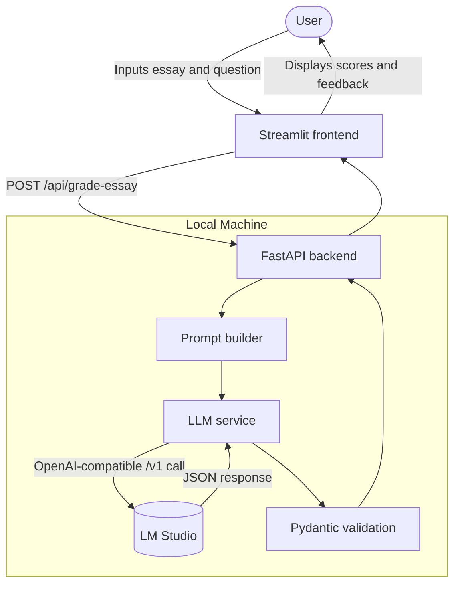

# Architecture

## Overview

The application uses a simple local client-server flow:

1. Streamlit collects the essay question and essay text.
2. The frontend sends a POST request to the FastAPI backend.
3. The backend builds a PTE grading prompt in `backend/core/prompt_builder.py`.
4. `backend/services/llm_service.py` sends the prompt to LM Studio through the OpenAI SDK.
5. The backend validates the returned JSON with Pydantic models from `backend/core/schemas.py`.
6. The frontend renders the validated result.

## Diagram

## Backend components

- `backend/main.py`: FastAPI app, CORS setup, and endpoints
- `backend/core/config.py`: loads `.env.local` and exposes typed settings
- `backend/core/schemas.py`: request and response validation models
- `backend/core/prompt_builder.py`: builds the system and user prompt pair
- `backend/services/llm_service.py`: LM Studio client, JSON extraction, validation, and retry

## Frontend components

- `frontend/app.py`: Streamlit UI, sample loader, API submission, and results rendering
- `frontend/assets/styles.css`: visual styling for the form and result sections

## Current behavior

- The frontend talks directly to the backend over HTTP.
- The backend returns `502` when LM Studio is unreachable or returns invalid output.
- The frontend surfaces backend failures as user-friendly messages.
- Sample essays and questions are stored locally in `data/` for quick testing.
