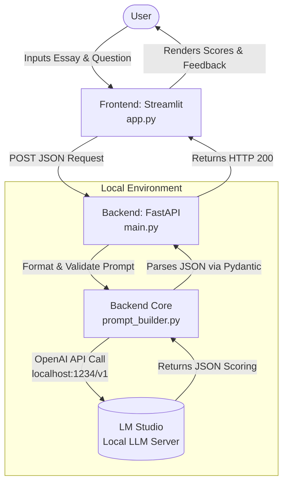

# Architecture

## Overview

The application follows a simple request-response path:

1. Streamlit collects a question and essay from the user.
2. FastAPI accepts a grading request.
3. The backend builds a prompt for the local LLM.
4. LM Studio returns grading JSON.
5. The backend validates the result and sends it back to the frontend.

## Diagram

## Phase 1 status

This repository currently contains the scaffolding, sample data, and placeholder modules required to support later implementation phases.
