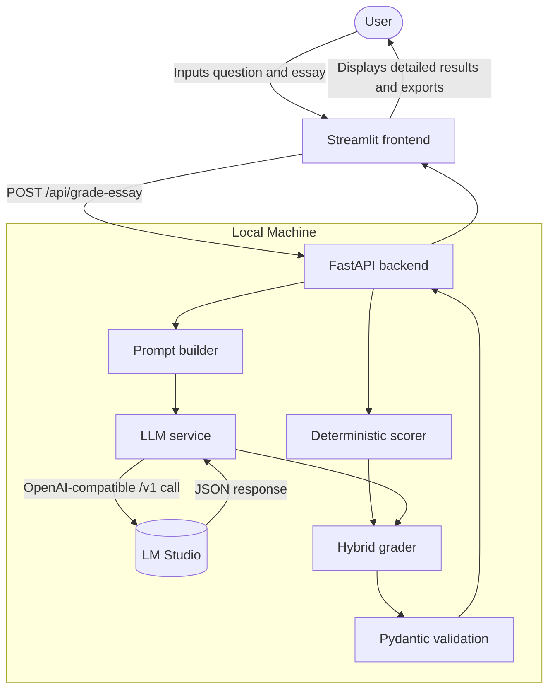

# Architecture

## Overview

The app uses a local client-server flow with a hybrid grading backend.

1. Streamlit collects the essay question and essay text.
2. The frontend sends `POST /api/grade-essay` to the FastAPI backend.
3. The deterministic scorer computes a stable baseline using measurable text signals.
4. The prompt builder prepares the PTE grading prompt for the local LLM.
5. The LLM service calls LM Studio through an OpenAI-compatible API.
6. The hybrid grader merges deterministic and LLM outputs under rule-based bounds.
7. Pydantic validates the final response payload.
8. The frontend renders the scores, feedback, details, and export options.

There is also a deterministic-only path through `POST /api/analyze-deterministic`.

## Diagram

## Backend components

- [backend/main.py](/Users/vuhung/00.Work/00.Workspace/essay-markings/backend/main.py)
  - FastAPI app
  - health endpoint
  - grading endpoints
- [backend/core/config.py](/Users/vuhung/00.Work/00.Workspace/essay-markings/backend/core/config.py)
  - loads `.env.local`
  - exposes typed settings
- [backend/core/schemas.py](/Users/vuhung/00.Work/00.Workspace/essay-markings/backend/core/schemas.py)
  - request/response schemas
  - detailed result payloads
  - deterministic signal models
- [backend/core/prompt_builder.py](/Users/vuhung/00.Work/00.Workspace/essay-markings/backend/core/prompt_builder.py)
  - builds the grading prompt for the LLM
- [backend/services/deterministic_scorer.py](/Users/vuhung/00.Work/00.Workspace/essay-markings/backend/services/deterministic_scorer.py)
  - Pearson-aligned deterministic baseline
  - prompt-aware content relevance
  - token-level spelling
  - sentence-level grammar/discourse signals
  - raw trait scoring mapped to the app rubric
- [backend/services/llm_service.py](/Users/vuhung/00.Work/00.Workspace/essay-markings/backend/services/llm_service.py)
  - LM Studio client
  - JSON extraction and normalization
  - defensive validation and fallback handling
- [backend/services/hybrid_grader.py](/Users/vuhung/00.Work/00.Workspace/essay-markings/backend/services/hybrid_grader.py)
  - bounded merge of deterministic and LLM outputs
  - Pearson-style content/form gating
  - detailed category explanations and deduction reasons

## Frontend components

- [frontend/app.py](/Users/vuhung/00.Work/00.Workspace/essay-markings/frontend/app.py)
  - Streamlit UI
  - sample loader
  - backend submission
  - detailed results rendering
  - Markdown/Word/PDF report export
- [frontend/assets/styles.css](/Users/vuhung/00.Work/00.Workspace/essay-markings/frontend/assets/styles.css)
  - app styling
  - dark/light theme support

## Data and support files

- [data/sample_questions.json](/Users/vuhung/00.Work/00.Workspace/essay-markings/data/sample_questions.json)
- [data/sample_essays.json](/Users/vuhung/00.Work/00.Workspace/essay-markings/data/sample_essays.json)
- [data/expected_outputs.json](/Users/vuhung/00.Work/00.Workspace/essay-markings/data/expected_outputs.json)
- [data/words.txt](/Users/vuhung/00.Work/00.Workspace/essay-markings/data/words.txt)
  - vendored SCOWL-based dictionary used by the deterministic spelling checker
- [data/words.SOURCE.md](/Users/vuhung/00.Work/00.Workspace/essay-markings/data/words.SOURCE.md)
  - source, command, and licensing note for the vendored word list

## Current behavior

- The app does not rely on pure LLM scoring for final numeric results.
- The deterministic scorer acts as a stable scoring anchor.
- The LLM contributes qualitative judgment and narrative feedback.
- The hybrid layer prevents the LLM from bypassing hard content/form gates.
- The frontend can export the current report as Markdown, Word, or PDF.
